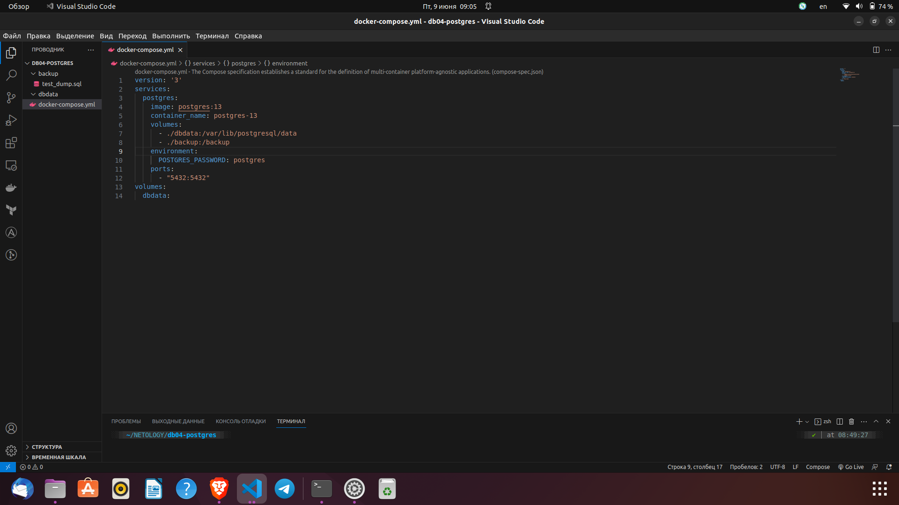
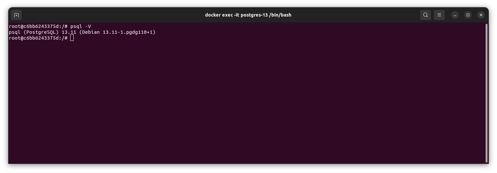
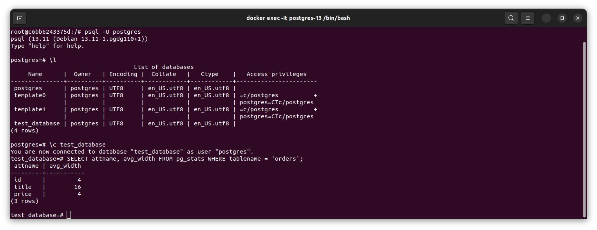
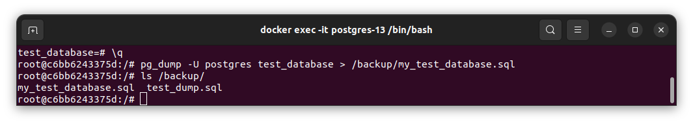
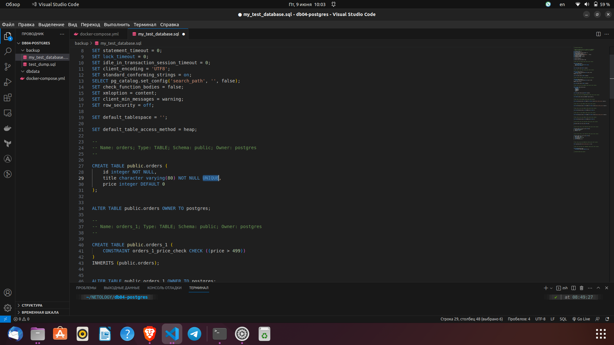

# Домашнее задание к занятию 4. «PostgreSQL»

# Никоноров Денис - FOPS-6

***

## Задача 1

Используя Docker, поднимите инстанс PostgreSQL (версию 13). Данные БД сохраните в volume.

Подключитесь к БД PostgreSQL, используя `psql`.

Воспользуйтесь командой `\?` для вывода подсказки по имеющимся в `psql` управляющим командам.

## *Выполение*
Развертывание postgres-13 c помощью docker-compose.yml



Подключение к docker контейнеру

```bash
docker exec -it postgres-13 /bin/bash
```



**Найдите и приведите** управляющие команды для:

- вывода списка БД,
- подключения к БД,
- вывода списка таблиц,
- вывода описания содержимого таблиц,
- выхода из psql.

## *Управляющие команды*

* Вывод списка БД - \l
* Подключение к БД - \с `db_name`
* Вывод списка таблиц - \dt
* Вывод описания содержимого таблиц - \d+ `table_name`
* Выход из psql - \q

## Задача 2

Используя `psql`, создайте БД `test_database`.

Изучите [бэкап БД](https://github.com/netology-code/virt-homeworks/tree/virt-11/06-db-04-postgresql/test_data).

Восстановите бэкап БД в `test_database`.

Перейдите в управляющую консоль `psql` внутри контейнера.

Подключитесь к восстановленной БД и проведите операцию ANALYZE для сбора статистики по таблице.

Используя таблицу [pg_stats](https://postgrespro.ru/docs/postgresql/12/view-pg-stats), найдите столбец таблицы `orders` 
с наибольшим средним значением размера элементов в байтах.

**Приведите в ответе** команду, которую вы использовали для вычисления, и полученный результат.

```sql
SELECT attname, avg_width FROM pg_stats WHERE tablename = 'orders';
```
```bash
 attname | avg_width 
---------+-----------
 id      |         4
 title   |        16
 price   |         4
(3 rows)
```



## Задача 3

Архитектор и администратор БД выяснили, что ваша таблица orders разрослась до невиданных размеров и
поиск по ней занимает долгое время. Вам как успешному выпускнику курсов DevOps в Нетологии предложили
провести разбиение таблицы на 2: шардировать на orders_1 - price>499 и orders_2 - price<=499.

Предложите SQL-транзакцию для проведения этой операции.

Можно ли было изначально исключить ручное разбиение при проектировании таблицы orders?

## *Выполение*

```sql
SELECT * FROM orders;
```
```bash
 id |        title         | price 
----+----------------------+-------
  1 | War and peace        |   100
  2 | My little database   |   500
  3 | Adventure psql time  |   300
  4 | Server gravity falls |   300
  5 | Log gossips          |   123
  6 | WAL never lies       |   900
  7 | Me and my bash-pet   |   499
  8 | Dbiezdmin            |   501
(8 rows)
```

```sql
test_database=# BEGIN;
BEGIN
test_database=*# CREATE TABLE orders_1 (CHECK (price > 499)) INHERITS (orders);
CREATE TABLE
test_database=*# INSERT INTO orders_1 SELECT * FROM orders WHERE price > 499;
INSERT 0 3
test_database=*# CREATE TABLE orders_2 (CHECK (price <= 499)) INHERITS (orders);
CREATE TABLE
test_database=*# INSERT INTO orders_2 SELECT * FROM orders WHERE price <= 499;
INSERT 0 5
test_database=*# DELETE FROM ONLY orders;
DELETE 8
test_database=*# COMMIT;
COMMIT
```

```sql
test_database=# SELECT * FROM orders_1;
 id |       title        | price 
----+--------------------+-------
  2 | My little database |   500
  6 | WAL never lies     |   900
  8 | Dbiezdmin          |   501
(3 rows)

test_database=# SELECT * FROM orders_2;
 id |        title         | price 
----+----------------------+-------
  1 | War and peace        |   100
  3 | Adventure psql time  |   300
  4 | Server gravity falls |   300
  5 | Log gossips          |   123
  7 | Me and my bash-pet   |   499
(5 rows)
```
*Можно ли было изначально исключить ручное разбиение при проектировании таблицы orders?*
Да если установить правила вставки.

```sql
CREATE RULE orders_insert_to_more AS ON INSERT TO orders WHERE (price > 499) DO INSTEAD INSERT INTO orders_1 VALUES (NEW.*);
CREATE RULE orders_insert_to_less AS ON INSERT TO orders WHERE (price <= 499) DO INSTEAD INSERT INTO orders_2 VALUES (NEW.*);
```

## Задача 4

Используя утилиту `pg_dump`, создайте бекап БД `test_database`.

Как бы вы доработали бэкап-файл, чтобы добавить уникальность значения столбца `title` для таблиц `test_database`?

## *Выполение*

```bash
pg_dump -U postgres test_database > /backup/my_test_database.sql
```



*Как бы вы доработали бэкап-файл, чтобы добавить уникальность значения столбца `title` для таблиц `test_database`?*

Нужно добавить свойство UNIQUE.

```sql
CREATE TABLE public.orders (
    id integer NOT NULL,
    title character varying(80) NOT NULL UNIQUE,
    price integer DEFAULT 0
);
```
